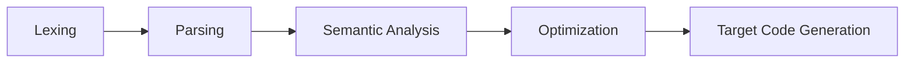

# 50.054 Project Lab 1 (10%)

## Deadline - 12 Nov 2023 23:59

In this project, we will develop a compiler for the SIMP programming language.

## Project template

The given project template consists the following major files and folders.

* `build.sbt` - the sbt project description file. You should not modify this, as you are not allowed to use other external libraries other than those have been specified in this file.
* `src` - the code folders containing the source code and the test code.

### Inside `src/main/scala/sutd/compiler/simp`
In side this folder, we have the following sub folders

1. `interpreter` - codes and modules for the interpreter implementation (lab 2)
1. `ir` - codes and modules for the intermedia representation (lab 1 and lab 2)
1. `monad` - library codes for monad stuff (you don't need to update anything inside)
1. `semantics` - codes and modules for semantic analyses and type checking (lab 2 and lab 3)
1. `syntax` - codes and modules for syntax analyses, i.e. lexing and parsing (lab 1)

### Tasks for this Lab

The two main tasks for this lab include

1. Parsing SIMP programs.
1. Generating Intermediate Representation (i.e. Pseudo Assembly) from a SIMP program.

There is no obvious dependency between the two tasks, hence you can divide the task among your team members if you wish to.

#### Task 0

Run `sbt build` and make sure there is no compilation error.

#### Task 1 - Complete the parser for SIMP programs

Recall that in the compiler pipeline


##### Lexing 
The first step is to perform *lexing*. Lexing is to scan through the input source file to ensure the text is constructed as a sequence of valid tokens specified by the syntax rules of the source langugage.

Recall that the SIMP language has the following grammar rules.

$$
\begin{array}{rccl}
(\tt Statement) & S & ::= & X = E ; \mid return\ X ; \mid nop; \mid if\ E\ \{ \overline{S} \}\ else\ \{ \overline{S} \} \mid while\ E\ \{ \overline{S} \} \\
(\tt Expression) & E & ::= & E\ OP\ E \mid X \mid C \mid (E) \\
(\tt Statements) & \overline{S} & ::= & S \mid S\ \overline{S} \\
(\tt Operator) & OP & ::= & + \mid - \mid * \mid < \mid > \mid == \\ 
(\tt Constant) & C & ::= & 0 \mid 1 \mid 2 \mid ... \mid true \mid false \\ 
(\tt Variable) & X & ::= & a \mid b \mid c \mid d \mid ... 
\end{array}
$$

At the moment, we do not handle division, as it might cause division by zero run-time errors.

The lexer for SIMP program has been implemented for you in `src/main/scala/sutd/compiler/simp/syntax/Lexer.scala`. 

On the high level, we consider the set of lexer tokens contains all terminal symbols in the above grammar.

```scala
enum LToken {
    case EqSign(src:SrcLoc)
    case DEqSign(src:SrcLoc)
    case PlusSign(src:SrcLoc)
    case MinusSign(src:SrcLoc)
    case AsterixSign(src:SrcLoc)
    ... // rest of the cases omitted
}
```

Where the `src:SrcLoc` refers to the line and column coordinate of the token in the source file. `SrcLoc` is defined in 
`SrcLoc.scala` under the same folder.

The top level function for the lexer is `lex:Parser[LEnv, List[LToken]]` which is a monadic parser that extract character sequence from the lexer environment `LEnv` and returns a list of lexer tokens. The entire lexer is implemented using monadic parser combinator. It has to make reference to the monad library `src/main/scala/sutd/compiler/simp/monad/Monad.scala` and
the parser combinator library `src/main/scala/sutd/compiler/simp/monad/Parsec.scala`.

There is no need to modify these files.

You can test the lexer by running the test cases in  `src/test/scala/sutd/compiler/simp/TestLexer.scala`, either via the VSCode IDE or via the following command

```bash
sbt compile "testOnly sutd.compiler.simp.TestLexer" 
```

You are recommended to study these test cases to get familiar with the input and output of the lexer. 

##### Parsing
The parser codes can be found in `src/main/scala/sutd/compiler/simp/syntax/Parser.scala`. Its main task is to consume the output from the lexer, i.e. `List[LToken]` and produce an abstract syntax tree. The abstract syntax tree data types can be found in `src/main/scala/sutd/compiler/simp/syntax/AST.scala`

```scala
enum Stmt {
    case Assign(x:Var, e:Exp) 
    case If(cond:Exp, th:List[Stmt], el:List[Stmt]) 
    case Nop
    case While(cond:Exp, b:List[Stmt]) 
    case Ret(x:Var)
}

case class Var(name:String)
    
enum Exp{
    case Plus(e1:Exp, e2:Exp)
    case Minus(e1:Exp, e2:Exp)
    case Mult(e1:Exp, e2:Exp)
    case DEqual(e1:Exp, e2:Exp)
    case LThan(e1:Exp, e2:Exp)
    case ConstExp(l:Const)
    case VarExp(v:Var)
    case ParenExp(e:Exp)
}

enum Const{
    case IntConst(v:Int)
    case BoolConst(v:Boolean)
}
```

The parser is designed and implemented using the monadic parser combinator library too. It consists of a few important functions and data types

1. `PEnv` - the parsec state object which keeps track of the input `List[LToken]`.
1. `p_stmts` - the parser that parses a sequence of SIMP statements.
1. `p_exp` - the parser that parses a SIMP expression.
1. and many other small parsers that form parts of the the main parsing routine.

The Parser codes are nearly complete. Except for the following 

###### Sub Task 1.1

Complete the definition of the `p_space` parser which parses one white space token.

Complete the definition of the `p_spaces` parser which parses multiple white space tokens.

Upon completion, you should be able to pass the four test cases for `p_spaces`.

```bash
sbt compile "testOnly sutd.compiler.simp.TestParser -- -z p_spaces" 
```

Hint: if you forget how to use parser combinator library, refer to the code in the notes and in `Lexer.scala`.

###### Sub Task 1.2

Complete the definition of the `p_exp` parser which parses an SIMP expression. 

Note that the grammar rule for expression contains a left-recursion. 

You should 

1. apply the left-recursion elimination to generate a left-recursion-free equivalent grammar for the expression. 
1. define the needed parser and sub parsers that parse the input using the left-recursion-free grammar.
1. convert the resulted expression AST in the left-recursion-free grammar back to the AST in the left-recursion grammar.

##### Testing the Parser

Now you should be able to pass all test cases in `src/test/scala/sutd/compiler/simp/TestParser.scala`


#### Task 2 - Implement the Maximal Munch Algorithm v2.

In lecture we learn how to use Maximal Munch Algorithm to generate pseudo assembly language from SIMP.

The AST data structure of the pseudo assembly is defined in `src/main/scala/sutd/compiler/ir/PseudoAssembly.scala`

```scala
type LabeledInstr = (Label, Instr)
type Label = Int 
enum Instr {
    case IMove(dest:Opr, src:Opr)
    case IPlus(dest:Opr, src1:Opr, src2:Opr)
    case IMinus(dest:Opr, src1:Opr, src2:Opr)
    case IMult(dest:Opr, src1:Opr, src2:Opr)
    case IDEqual(dest:Opr, src1:Opr, src2:Opr)
    case ILThan(dest:Opr, src1:Opr, src2:Opr)
    case IRet
    case IIfNot(cond:Opr, dest:Label)
    case IGoto(dest:Label)
}

enum Opr {
    case Regstr(name:String)
    case IntLit(v:Int)
    case Temp(v:AVar)
}

case class AVar(name:String)
```

The original Maximal Munch Algorithm is implemented in `src/main/scala/sutd/compiler/simp/ir/MaximalMunch.scala`. 

It is implemented using
* a state mona - which enables us to generate new variable names without clashing, generate new label for the instruction.

The state monad `StateCogenMonad` combines a state monad transformer `StateT` and `Identity` monads. 
You don't need to worry about the details of monad transformer in order to use it. As the interface functions are exactly the same to those in a normal state monad. The basic util functions of `StateCogenMonad` include

* `get` - reads the current state
* `put` - updates the state

And some extended util functions are as follow

* `newName` - generate a unique new string
* `newTemp` - generate a new temp variable
* `mkRegstr` - create a new register
* `chkNextLabel` - query for  the next label

You may study `MaximalMunch.scala` to get yourself familiar with the usable of the monad. 
You may also study `src/test/scala/sutd/compiler/simp/TestMaximalMunch.scala` to understand how the IR is generated.

##### Sub Task 2.1

Your task here is to complete the implementation of Maximal Munch v2 algorithm in the file `src/main/scala/sutd/compiler/simp/ir/MMUpDown.scala`. 


The function `genExp` implements the $G_e(E) \vdash (\^{e}, \v{e})$ rules. There are some cases missing. Your should implement the few missing cases. 

Upon completion, you should be able to pass the two test cases for `genExp`.

```bash
sbt compile "testOnly sutd.compiler.simp.TestMMUpDown -- -z genExp" 
```


##### Sub Task 2.2 

The function `cogen` implements the $G_s(S) \vdash lis$ rules. There are some cases missing. Your should implement the few missing cases. 


##### Testing the Maximal Munch Algorithm v2 implementation 

Now you should be able to pass all test cases in `src/test/scala/sutd/compiler/simp/TestMMUpDown.scala`

